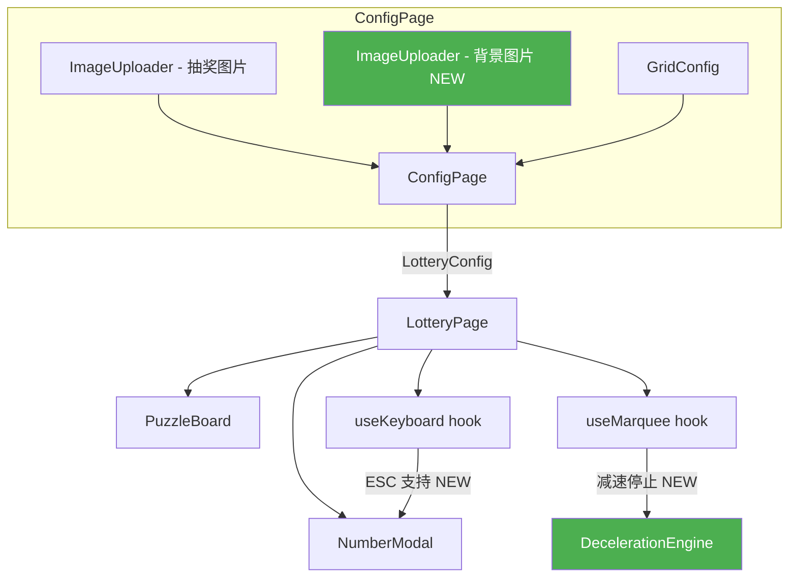
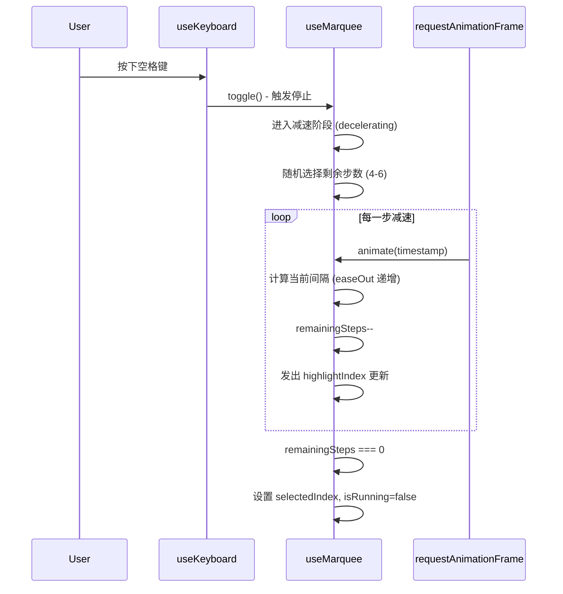
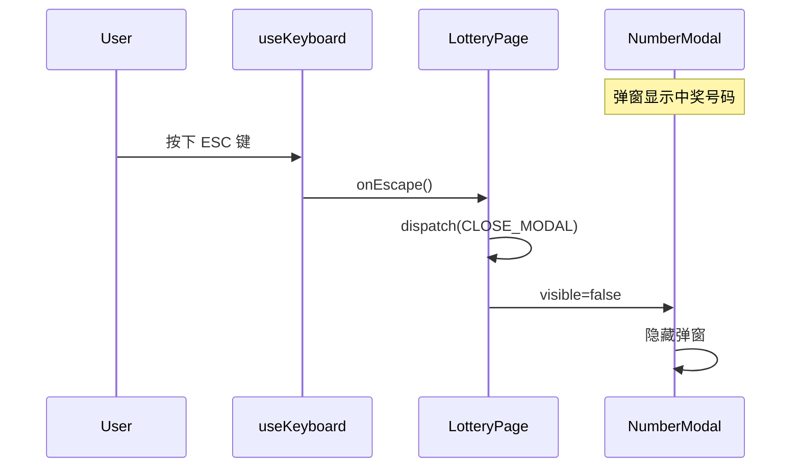

# Design Document: 抽奖拼图系统增强 (Lottery Puzzle Enhancements)

## Overview

本设计文档描述对现有抽奖拼图系统的五项增强功能：(1) 跑马灯减速停止机制——按空格后不再立即停止，而是逐步减速并在走过4-6块拼图后自然停下；(2) 支持配置背景图片，让抽奖页面可以展示自定义背景；(3) 调整拼图布局以适配4米高大屏幕，拼图区域从屏幕最下沿起1m到2.8m的位置；(4) 优化中奖弹窗——数字背景色改为 `rgb(5, 69, 214)`，移除右上角关闭按钮，改为 ESC 键关闭；(5) 翻转后的拼图卡片背面颜色改为 `rgb(4, 4, 63)`，保持拼图形状裁剪，呈现拼图卡片翻过来的视觉效果。

现有系统基于 React 18 + TypeScript + Vite + CSS Modules 构建，使用 `useMarquee` hook 控制跑马灯逻辑，`useKeyboard` hook 监听键盘事件，`NumberModal` 组件展示中奖号码。本次增强在保持现有架构不变的前提下，对相关模块进行最小化修改。

## Architecture



## Sequence Diagrams

### 减速停止流程



### ESC 关闭弹窗流程



## Components and Interfaces

### Component 1: useMarquee (增强)

**Purpose**: 控制跑马灯高亮遍历，新增减速停止机制

**Interface**:
```typescript
export interface UseMarqueeOptions {
  totalTiles: number;
  speed: number;              // 基础速度 ms/步
  traversalOrder: number[];
  skipFlipped: boolean;
  flippedSet: Set<number>;
  decelerationSteps?: [number, number]; // 减速步数范围，默认 [4, 6]
}

export interface UseMarqueeReturn {
  isRunning: boolean;
  isDecelerating: boolean;      // NEW: 是否正在减速中
  highlightIndex: number | null;
  selectedIndex: number | null;
  toggle: () => void;
  reset: () => void;
}
```

**Responsibilities**:
- 跑马灯启动时以固定速度遍历拼图
- 按空格触发减速：随机选择4-6步剩余步数，逐步增大间隔时间
- 减速期间禁止再次按空格
- 减速结束后设置 selectedIndex 并停止

### Component 2: useKeyboard (增强)

**Purpose**: 监听键盘事件，新增 ESC 键支持

**Interface**:
```typescript
export interface UseKeyboardOptions {
  onSpace: () => void;
  onEscape?: () => void;   // NEW: ESC 键回调
  enabled: boolean;
}
```

### Component 3: JigsawTile (修改)

**Purpose**: 翻转后的拼图卡片背面样式优化

**当前实现**:
- 背面使用 `rgba(0,0,0,0.85)` 填充矩形，通过 SVG clipPath 裁剪为拼图形状
- 号码文字颜色为 `#FFD700`

**修改点**:
- 背面填充色从 `rgba(0,0,0,0.85)` 改为 `rgb(4, 4, 63)`
- 保持 SVG clipPath 裁剪，确保背面仍呈现拼图形状轮廓
- 翻转效果保持 CSS 3D rotateY(180deg)，视觉上呈现拼图卡片翻过来的效果
- 号码文字颜色保持 `#FFD700`（金色），在深蓝背景上对比度良好

**SVG 背面结构**:
```xml
<svg>
  <defs>
    <clipPath id="tile-clip-{index}-back"><path d="{tilePath}" /></clipPath>
  </defs>
  <!-- 背面填充：使用拼图形状裁剪，颜色改为 rgb(4,4,63) -->
  <rect x={offsetX} y={offsetY} width={tileWidth} height={tileHeight}
    fill="rgb(4, 4, 63)" clipPath="url(#tile-clip-{index}-back)" />
  <!-- 号码文字 -->
  <text fill="#FFD700" ...>{lotteryNumber}</text>
</svg>
```

### Component 4: NumberModal (修改)

**Purpose**: 展示中奖号码，背景色改为蓝色，移除关闭按钮，仅支持 ESC 关闭

**Interface**:
```typescript
export interface NumberModalProps {
  number: string;
  visible: boolean;
  onClose: () => void;  // 由 ESC 键触发
}
```

**修改点**:
- 移除右上角 `×` 关闭按钮
- 移除 overlay 点击关闭功能
- 背景色从 `#1a1a2e` 改为 `rgb(5, 69, 214)`
- 关闭仅通过 ESC 键实现

### Component 5: ConfigPage (增强)

**Purpose**: 新增背景图片上传功能

**修改点**:
- 新增第二个 ImageUploader 用于背景图片
- 背景图片为可选配置

### Component 6: LotteryPage (修改)

**Purpose**: 调整布局比例，支持背景图片

**修改点**:
- 布局从 42.5vh/32.5vh/25vh 改为 30vh/45vh/25vh
- 支持通过 CSS 设置背景图片
- 传递 ESC 回调给 useKeyboard

## Data Models

### LotteryConfig (增强)

```typescript
export interface LotteryConfig {
  imageFile: File;
  rows: number;
  cols: number;
  backgroundImage?: File;  // NEW: 可选背景图片
}
```

**Validation Rules**:
- `backgroundImage` 为可选字段
- 如果提供，必须是有效的图片文件 (jpg/jpeg/png)
- 使用现有的 `validateImageFile` 函数验证

### MarqueeState (增强)

```typescript
export interface MarqueeState {
  isRunning: boolean;
  isDecelerating: boolean;       // NEW: 减速阶段标记
  highlightIndex: number | null;
  selectedIndex: number | null;
  speed: number;
  remainingSteps: number | null; // NEW: 减速剩余步数
}
```

## Key Functions with Formal Specifications

### Function 1: useMarquee.toggle() (重写)

```typescript
const toggle = useCallback(() => {
  if (isDecelerating) return; // 减速中忽略操作

  setIsRunning(prev => {
    if (prev) {
      // 触发减速而非立即停止
      startDeceleration();
      return true; // 保持运行直到减速完成
    } else {
      setSelectedIndex(null);
      return true;
    }
  });
}, [traversalOrder, isDecelerating]);
```

**Preconditions:**
- `traversalOrder.length > 0`
- 当 `isDecelerating === true` 时，调用无效果

**Postconditions:**
- 如果之前在运行：进入减速阶段，`isDecelerating = true`
- 如果之前停止：开始运行，`isRunning = true`，`selectedIndex = null`
- 减速完成后：`isRunning = false`，`selectedIndex` 为最终停留位置

### Function 2: startDeceleration()

```typescript
function startDeceleration(): void
```

**Preconditions:**
- `isRunning === true`
- `isDecelerating === false`
- `traversalOrder.length > 0`

**Postconditions:**
- `isDecelerating = true`
- `remainingSteps` 设为 [4, 6] 范围内的随机整数
- 动画间隔按 easeOut 曲线从 `speed` 递增到 `speed * 4`

**Loop Invariants:**
- `remainingSteps >= 0`
- 每步间隔 `interval_i = speed + (speed * 3) * easeOut(i / totalDecelerationSteps)`
- 间隔单调递增

### Function 3: calculateDecelerationInterval()

```typescript
function calculateDecelerationInterval(
  step: number,
  totalSteps: number,
  baseSpeed: number
): number
```

**Preconditions:**
- `step >= 0 && step < totalSteps`
- `totalSteps > 0`
- `baseSpeed > 0`

**Postconditions:**
- 返回值 >= `baseSpeed`
- 返回值 <= `baseSpeed * 4`
- `step` 越大，返回值越大（单调递增）
- 使用 easeOut 缓动：`progress = step / totalSteps`，`eased = 1 - (1 - progress)^2`

## Algorithmic Pseudocode

### 减速停止算法

```typescript
// 减速动画核心逻辑
function decelerateAnimation(timestamp: number): void {
  // 前置条件: isDecelerating === true, remainingSteps > 0

  const elapsed = timestamp - lastTimeRef.current;
  const currentInterval = calculateDecelerationInterval(
    totalDecelerationSteps - remainingSteps,
    totalDecelerationSteps,
    baseSpeed
  );

  if (elapsed >= currentInterval) {
    lastTimeRef.current = timestamp;

    // 前进一步
    const nextStep = findNextStep(currentStepRef.current);
    currentStepRef.current = nextStep;
    setCurrentStep(nextStep);
    remainingSteps--;

    if (remainingSteps === 0) {
      // 减速完成，停止
      setIsDecelerating(false);
      setIsRunning(false);
      setSelectedIndex(traversalOrder[nextStep] ?? null);
      return;
    }
  }

  animIdRef.current = requestAnimationFrame(decelerateAnimation);
}

// 缓动函数: easeOutQuad
function calculateDecelerationInterval(
  step: number,
  totalSteps: number,
  baseSpeed: number
): number {
  const progress = step / totalSteps;
  const eased = 1 - Math.pow(1 - progress, 2); // easeOutQuad
  return baseSpeed + (baseSpeed * 3) * eased;
  // step=0 → baseSpeed (100ms)
  // step=totalSteps → baseSpeed * 4 (400ms)
}
```

### 布局计算

```typescript
// 大屏幕高 4m，拼图从最下沿起 1m 到 2.8m
// 1m from bottom = 3m from top = 75vh
// 2.8m from bottom = 1.2m from top = 30vh
// 拼图区域: top=30vh, height=45vh

const LAYOUT = {
  titleAreaHeight: '30vh',   // 顶部到拼图区 (0 ~ 1.2m from top)
  puzzleAreaHeight: '45vh',  // 拼图区 (1.2m ~ 3.0m from top)
  bottomAreaHeight: '25vh',  // 底部区域 (3.0m ~ 4.0m from top)
} as const;

const PUZZLE_AREA_VH = 45; // 用于计算 tileHeight
```

## Example Usage

```typescript
// 1. 减速停止 - useMarquee 使用
const marquee = useMarquee({
  totalTiles: rows * cols,
  speed: 100,
  traversalOrder,
  skipFlipped: true,
  flippedSet,
  decelerationSteps: [4, 6],
});

// 按空格 → marquee.toggle()
// 跑马灯进入减速阶段，走4-6步后停止

// 2. ESC 关闭弹窗 - useKeyboard 使用
useKeyboard({
  onSpace: marquee.toggle,
  onEscape: handleModalClose,
  enabled: !isFlipping,
});

// 3. 背景图片配置
const config: LotteryConfig = {
  imageFile: puzzleImage,
  rows: 5,
  cols: 20,
  backgroundImage: bgImage, // 可选
};

// 4. LotteryPage 背景图片渲染
<div
  className={styles.container}
  style={backgroundUrl ? {
    backgroundImage: `url(${backgroundUrl})`,
    backgroundSize: 'cover',
    backgroundPosition: 'center',
  } : undefined}
>
```

## Correctness Properties

*属性（Property）是指在系统所有有效执行中都应成立的特征或行为——本质上是对系统行为的形式化陈述。属性是人类可读规格说明与机器可验证正确性保证之间的桥梁。*

### Property 1: 减速步数范围

*For any* toggle 操作（在跑马灯运行中触发停止），减速引擎选择的剩余步数应为 4 到 6 之间的整数（含边界）。

**Validates: Requirement 1.1**

### Property 2: 减速间隔函数正确性（边界 + 单调性）

*For any* 正整数 baseSpeed 和正整数 totalSteps，以及 0 ≤ step < totalSteps，`calculateDecelerationInterval(step, totalSteps, baseSpeed)` 的返回值应满足：(a) 不小于 baseSpeed；(b) 不大于 baseSpeed × 4；(c) 对于 step_i < step_j，`interval(step_i) ≤ interval(step_j)`（单调递增）。

**Validates: Requirements 1.2, 1.5**

### Property 3: 减速期间不可中断

*For any* 处于 Deceleration_Phase 的跑马灯状态，调用 toggle() 应不改变 isRunning、isDecelerating 和 remainingSteps 的值。

**Validates: Requirement 1.3**

### Property 4: 减速完成后状态正确

*For any* 减速过程完成（remainingSteps 减至 0）后，isRunning 应为 false，isDecelerating 应为 false，selectedIndex 应为非 null 值且对应一个有效的拼图块索引。

**Validates: Requirement 1.4**

### Property 5: 背景图片可选配置

*For any* 有效的 LotteryConfig，当 backgroundImage 为 undefined 时，配置验证应通过且系统正常运行。

**Validates: Requirement 2.2**

### Property 6: 布局比例与拼图高度计算

*For any* 正整数 rows 和正数 windowHeight，三个区域高度之和应等于 100vh（30 + 45 + 25 = 100），且 tileHeight 应等于 (windowHeight × 45 / 100) / rows。

**Validates: Requirements 3.2, 3.3**

## Error Handling

### Error 1: 背景图片加载失败

**Condition**: 用户上传的背景图片文件损坏或格式不支持
**Response**: 回退到默认纯色背景 `#1a1a2e`，不影响抽奖功能
**Recovery**: 用户可在配置页重新上传

### Error 2: 减速过程中所有剩余拼图已翻转

**Condition**: 减速期间 `skipFlipped=true` 且所有未翻转拼图在减速步数内被跳过
**Response**: 立即停止减速，选中最后一个有效拼图
**Recovery**: 自动处理，无需用户干预

### Error 3: 窗口尺寸变化导致布局异常

**Condition**: 大屏幕分辨率与预期不符
**Response**: 使用 vh 单位确保比例自适应
**Recovery**: 布局基于百分比，自动适配

## Testing Strategy

### Unit Testing

- `useMarquee`: 测试减速逻辑、步数范围、间隔计算
- `useKeyboard`: 测试 ESC 键回调
- `NumberModal`: 测试无关闭按钮、背景色
- `ConfigPage`: 测试背景图片上传
- `JigsawTile`: 测试翻转后背面颜色为 rgb(4,4,63)、保持拼图形状裁剪

### Property-Based Testing (fast-check)

- `calculateDecelerationInterval`: 间隔单调递增、边界值正确
- 减速步数随机性: 多次运行步数分布在 [4, 6]
- `LotteryConfig` 验证: 有/无背景图片均通过验证

### Integration Testing

- 完整减速停止流程: 空格 → 减速 → 停止 → 翻转 → 弹窗
- ESC 关闭流程: 弹窗显示 → ESC → 弹窗关闭
- 背景图片流程: 配置上传 → 抽奖页显示背景

## Performance Considerations

- 减速动画使用 `requestAnimationFrame`，与现有跑马灯动画共用同一帧循环，无额外性能开销
- 背景图片使用 CSS `background-image`，由浏览器原生渲染，不影响 Canvas/SVG 性能
- 布局调整仅涉及 CSS 变更，零运行时开销

## Dependencies

- 无新增外部依赖
- 继续使用现有技术栈: React 18, TypeScript, Vite, CSS Modules, Vitest, fast-check
