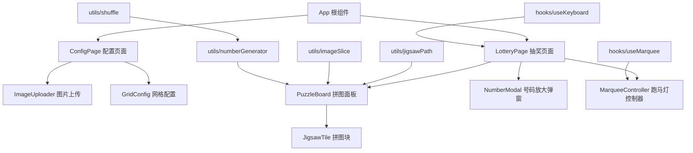
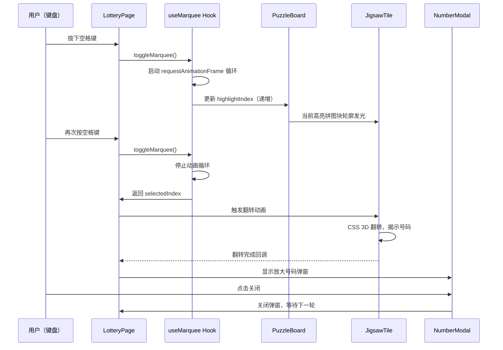
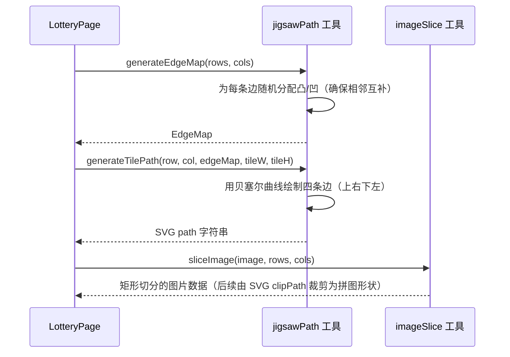

# 设计文档：抽奖拼图系统（V2）

## 概述

抽奖拼图系统是一个基于浏览器的单页应用（SPA），用于活动现场大屏幕（7m × 4m）抽奖。系统由两个主要页面组成：配置页面和抽奖页面。活动组织者在配置页面上传图片并设置网格参数，进入抽奖页面后，图片被切分为具有真实拼图形状（凸凹互锁边缘）的拼图块，排列在屏幕中部区域（高度 1.7m~3m 处）。

V2 版本的核心变更：拼图块不再是简单的矩形网格切割，而是具有经典拼图形状的互锁拼图块。抽奖过程采用跑马灯动画——拼图块的外轮廓依次发光，用户通过键盘空格键控制跑马灯的启停，停止时选中的拼图块翻转揭示对应的中奖号码。

### 技术选型

- **前端框架**：React 18 + TypeScript
- **构建工具**：Vite
- **样式方案**：CSS Modules
- **状态管理**：React useReducer
- **拼图形状**：SVG clipPath + 贝塞尔曲线生成拼图边缘
- **轮廓发光**：SVG filter（drop-shadow / glow）应用于拼图轮廓路径
- **动画**：CSS 3D Transform（翻转）+ requestAnimationFrame（跑马灯）
- **测试**：Vitest + fast-check（属性测试）

### 设计决策

1. **SVG clipPath 拼图形状**：每个拼图块使用 SVG clipPath 裁剪图片，拼图边缘通过贝塞尔曲线生成凸（tab）和凹（blank）形状。相邻拼图块的边缘互补（一凸一凹）。
2. **轮廓发光而非整块高亮**：使用 SVG path 绘制拼图块的外轮廓，通过 CSS filter: drop-shadow() 或 SVG feGaussianBlur 实现发光效果，仅高亮边缘轮廓。
3. **跑马灯遍历顺序**：按蛇形顺序（第一行从左到右，第二行从右到左，交替）遍历拼图块，视觉效果更连贯。
4. **键盘控制**：空格键切换跑马灯启停，简单直观，适合大屏幕远程操控。
5. **屏幕布局适配**：7m x 4m 屏幕，拼图区域位于高度 1.7m~3m（占屏幕高度的 32.5%），上方 42.5% 和下方 25% 留作标题和信息展示区。
6. **纯前端应用**：无需后端服务，所有逻辑在浏览器端完成。

## 架构



核心流程：

1. ConfigPage 收集用户配置（图片 + 行列数）
2. 配置完成后切换到 LotteryPage
3. LotteryPage 初始化时：调用工具函数切图、生成拼图路径、生成号码、洗牌分配
4. 用户按空格键启动跑马灯，拼图块外轮廓依次发光
5. 再次按空格键停止，选中的拼图块翻转揭示号码，弹窗放大显示

## 主要流程

### 跑马灯抽奖流程



### 拼图形状生成流程



## 屏幕布局

```
+---------------------------------------------+ 0m
|                                             |
|            标题 / 活动信息区                 |
|           （屏幕高度 0~1.7m）                |
|              占比 42.5%                      |
|                                             |
+---------------------------------------------+ 1.7m
|                                             |
|     拼图网格区域 20列 x 5行                  |
|     （屏幕高度 1.7m~3.0m）                   |
|           占比 32.5%                         |
|                                             |
+---------------------------------------------+ 3.0m
|                                             |
|         底部信息区 / 中奖号码展示            |
|          （屏幕高度 3.0m~4.0m）              |
|              占比 25%                        |
|                                             |
+---------------------------------------------+ 4m
         <-------- 7m -------->
```

CSS 布局映射（使用 viewport 百分比）：
- 标题区：`top: 0; height: 42.5vh`
- 拼图区：`top: 42.5vh; height: 32.5vh`
- 底部区：`top: 75vh; height: 25vh`

## 组件与接口

### ConfigPage 配置页面组件（保持不变）

```typescript
interface ConfigPageProps {
  onConfigComplete: (config: LotteryConfig) => void;
}
```

### ImageUploader 图片上传组件（保持不变）

```typescript
interface ImageUploaderProps {
  onImageSelect: (file: File) => void;
  selectedFile: File | null;
}
```

### GridConfig 网格配置组件（保持不变）

```typescript
interface GridConfigProps {
  rows: number;
  cols: number;
  onRowsChange: (rows: number) => void;
  onColsChange: (cols: number) => void;
}
```

### LotteryPage 抽奖页面组件（重构）

```typescript
interface LotteryPageProps {
  config: LotteryConfig;
}

// 职责：
// - 管理抽奖状态（跑马灯、翻转、弹窗）
// - 监听键盘事件（空格键启停跑马灯）
// - 协调 PuzzleBoard 和 NumberModal
```

### PuzzleBoard 拼图面板组件（新增，替代 PuzzleGrid）

```typescript
interface PuzzleBoardProps {
  tiles: TileData[];
  edgeMap: EdgeMap;
  highlightIndex: number | null;  // 当前跑马灯高亮的拼图块索引
  onTileFlipComplete: (index: number) => void;
  flippingIndex: number | null;   // 正在翻转的拼图块索引
  rows: number;
  cols: number;
  tileWidth: number;   // 单块拼图宽度（px）
  tileHeight: number;  // 单块拼图高度（px）
}

// 职责：
// - 使用 SVG 渲染拼图形状的网格
// - 管理拼图块的轮廓发光效果
// - 处理翻转动画触发
```

### JigsawTile 拼图块组件（新增，替代 PuzzleTile）

```typescript
interface JigsawTileProps {
  tile: TileData;
  path: string;              // SVG path 字符串（拼图形状）
  isHighlighted: boolean;    // 是否处于跑马灯高亮状态
  isFlipping: boolean;       // 是否正在翻转
  onFlipComplete: () => void;
  tileWidth: number;
  tileHeight: number;
  offsetX: number;           // 拼图块在面板中的 X 偏移
  offsetY: number;           // 拼图块在面板中的 Y 偏移
}

// 职责：
// - 使用 SVG clipPath 裁剪图片为拼图形状
// - 渲染轮廓发光效果（SVG path + filter）
// - 处理翻转动画（CSS 3D Transform）
```

### NumberModal 号码放大弹窗组件（保持不变）

```typescript
interface NumberModalProps {
  number: string;
  visible: boolean;
  onClose: () => void;
}
```

### useMarquee Hook（新增）

```typescript
interface UseMarqueeOptions {
  totalTiles: number;
  speed: number;              // 跑马灯速度（ms/步）
  traversalOrder: number[];   // 遍历顺序（蛇形排列的索引数组）
  skipFlipped: boolean;       // 是否跳过已翻转的拼图块
  flippedSet: Set<number>;    // 已翻转拼图块索引集合
}

interface UseMarqueeReturn {
  isRunning: boolean;
  highlightIndex: number | null;  // 当前高亮的拼图块索引
  selectedIndex: number | null;   // 停止时选中的拼图块索引
  toggle: () => void;             // 启停切换
  reset: () => void;              // 重置选中状态
}

function useMarquee(options: UseMarqueeOptions): UseMarqueeReturn;

// 职责：
// - 管理跑马灯动画循环（requestAnimationFrame）
// - 按遍历顺序依次高亮拼图块
// - 启停控制，停止时返回当前选中索引
// - 跳过已翻转的拼图块
```

### useKeyboard Hook（新增）

```typescript
interface UseKeyboardOptions {
  onSpace: () => void;   // 空格键回调
  enabled: boolean;       // 是否启用监听
}

function useKeyboard(options: UseKeyboardOptions): void;

// 职责：
// - 监听 keydown 事件
// - 空格键触发回调
// - 防止空格键默认行为（页面滚动）
```

## 拼图形状生成算法

### 核心概念

每个拼图块有四条边（上、右、下、左），每条边可以是：
- **平边（flat）**：位于网格边界的边
- **凸边（tab）**：向外突出的贝塞尔曲线
- **凹边（blank）**：向内凹陷的贝塞尔曲线

相邻拼图块的共享边必须互补：一个凸，另一个凹。

### EdgeMap 数据结构

```typescript
/** 边缘类型 */
type EdgeType = 'flat' | 'tab' | 'blank';

/** 边缘映射：记录每条边的凸凹状态 */
interface EdgeMap {
  /** 水平边：horizontal[row][col]，row 范围 0~rows（含边界），col 范围 0~cols-1 */
  horizontal: EdgeType[][];
  /** 垂直边：vertical[row][col]，row 范围 0~rows-1，col 范围 0~cols（含边界） */
  vertical: EdgeType[][];
}
```

### 边缘生成算法

```typescript
function generateEdgeMap(rows: number, cols: number): EdgeMap;
```

**前置条件：**
- rows >= 1 且 cols >= 1

**后置条件：**
- 网格边界上的所有边为 flat
- 内部每条边随机为 tab 或 blank
- 相邻拼图块共享边互补：若 A 的右边为 tab，则 B 的左边为 blank

**算法伪代码：**

```pascal
ALGORITHM generateEdgeMap(rows, cols)
INPUT: rows, cols 正整数
OUTPUT: EdgeMap

BEGIN
  // 初始化水平边（rows+1 行，cols 列）
  FOR row <- 0 TO rows DO
    FOR col <- 0 TO cols-1 DO
      IF row = 0 OR row = rows THEN
        horizontal[row][col] <- 'flat'
      ELSE
        horizontal[row][col] <- randomChoice('tab', 'blank')
      END IF
    END FOR
  END FOR

  // 初始化垂直边（rows 行，cols+1 列）
  FOR row <- 0 TO rows-1 DO
    FOR col <- 0 TO cols DO
      IF col = 0 OR col = cols THEN
        vertical[row][col] <- 'flat'
      ELSE
        vertical[row][col] <- randomChoice('tab', 'blank')
      END IF
    END FOR
  END FOR

  RETURN { horizontal, vertical }
END
```

### 单块拼图路径生成

```typescript
function generateTilePath(
  row: number, col: number,
  edgeMap: EdgeMap,
  tileW: number, tileH: number
): string;
```

**前置条件：**
- row, col 在有效范围内
- edgeMap 已正确生成
- tileW, tileH > 0

**后置条件：**
- 返回有效的 SVG path d 属性字符串
- 路径闭合，描述该拼图块的完整轮廓
- 凸边向外突出约 tileW * 0.12 或 tileH * 0.12

**边缘绘制逻辑（以上边为例）：**

```pascal
ALGORITHM drawEdge(startX, startY, endX, endY, edgeType, isHorizontal)
INPUT: 起点终点坐标，边缘类型，是否水平边
OUTPUT: SVG path 片段

BEGIN
  IF edgeType = 'flat' THEN
    RETURN "L endX endY"
  END IF

  midX <- (startX + endX) / 2
  midY <- (startY + endY) / 2
  
  // 凸凹方向：tab 向外突出，blank 向内凹陷
  direction <- IF edgeType = 'tab' THEN 1 ELSE -1
  
  IF isHorizontal THEN
    bulge <- tileH * 0.12 * direction
    // 使用三次贝塞尔曲线绘制拼图凸凹
    RETURN 
      "L" (startX + tileW*0.35) startY
      "C" (startX + tileW*0.35) (startY - bulge*0.8)
          (startX + tileW*0.3) (startY - bulge)
          midX (startY - bulge)
      "C" (startX + tileW*0.7) (startY - bulge)
          (startX + tileW*0.65) (startY - bulge*0.8)
          (startX + tileW*0.65) startY
      "L" endX endY
  ELSE
    bulge <- tileW * 0.12 * direction
    // 垂直边类似，方向旋转90度
    RETURN
      "L" startX (startY + tileH*0.35)
      "C" (startX + bulge*0.8) (startY + tileH*0.35)
          (startX + bulge) (startY + tileH*0.3)
          (startX + bulge) midY
      "C" (startX + bulge) (startY + tileH*0.7)
          (startX + bulge*0.8) (startY + tileH*0.65)
          startX (startY + tileH*0.65)
      "L" endX endY
  END IF
END
```

### 完整拼图块路径组装

```pascal
ALGORITHM generateTilePath(row, col, edgeMap, tileW, tileH)
INPUT: 行列位置，边缘映射，拼图块尺寸
OUTPUT: SVG path d 字符串

BEGIN
  x <- col * tileW
  y <- row * tileH
  
  topEdge <- edgeMap.horizontal[row][col]
  rightEdge <- edgeMap.vertical[row][col + 1]
  bottomEdge <- edgeMap.horizontal[row + 1][col]
  leftEdge <- edgeMap.vertical[row][col]
  
  path <- "M" x y
  
  // 上边：从左到右
  path += drawEdge(x, y, x + tileW, y, topEdge, true)
  
  // 右边：从上到下
  path += drawEdge(x + tileW, y, x + tileW, y + tileH, rightEdge, false)
  
  // 下边：从右到左（注意方向反转，凸凹也反转）
  path += drawEdge(x + tileW, y + tileH, x, y + tileH, invertEdge(bottomEdge), true)
  
  // 左边：从下到上（注意方向反转）
  path += drawEdge(x, y + tileH, x, y, invertEdge(leftEdge), false)
  
  path += "Z"
  
  RETURN path
END
```

### 蛇形遍历顺序生成

```typescript
function generateSnakeOrder(rows: number, cols: number): number[];
```

**后置条件：**
- 返回长度为 rows x cols 的索引数组
- 偶数行（0-indexed）从左到右，奇数行从右到左

```pascal
ALGORITHM generateSnakeOrder(rows, cols)
INPUT: rows, cols
OUTPUT: number[]

BEGIN
  order <- []
  FOR row <- 0 TO rows-1 DO
    IF row MOD 2 = 0 THEN
      FOR col <- 0 TO cols-1 DO
        order.push(row * cols + col)
      END FOR
    ELSE
      FOR col <- cols-1 DOWNTO 0 DO
        order.push(row * cols + col)
      END FOR
    END IF
  END FOR
  RETURN order
END
```

## 轮廓发光效果实现

### SVG 结构

每个拼图块由以下 SVG 元素组成：

```xml
<svg>
  <defs>
    <!-- 拼图形状裁剪路径 -->
    <clipPath id="tile-clip-{index}">
      <path d="{tilePath}" />
    </clipPath>
    
    <!-- 发光滤镜 -->
    <filter id="glow-filter">
      <feGaussianBlur stdDeviation="3" result="blur" />
      <feFlood flood-color="#FFD700" flood-opacity="0.8" />
      <feComposite in2="blur" operator="in" />
      <feMerge>
        <feMergeNode />
        <feMergeNode in="SourceGraphic" />
      </feMerge>
    </filter>
  </defs>
  
  <!-- 图片层：用 clipPath 裁剪 -->
  <image 
    href="{imageDataUrl}" 
    clip-path="url(#tile-clip-{index})"
  />
  
  <!-- 轮廓层：仅在高亮时显示 -->
  <path 
    d="{tilePath}" 
    fill="none" 
    stroke="#FFD700" 
    stroke-width="3"
    filter="url(#glow-filter)"
    class="contour-glow"
    visibility="{isHighlighted ? 'visible' : 'hidden'}"
  />
</svg>
```

### 发光动画 CSS

```css
.contour-glow {
  animation: glow-pulse 0.5s ease-in-out infinite alternate;
}

@keyframes glow-pulse {
  from {
    stroke-opacity: 0.6;
    filter: drop-shadow(0 0 4px #FFD700);
  }
  to {
    stroke-opacity: 1.0;
    filter: drop-shadow(0 0 12px #FFD700) drop-shadow(0 0 20px #FFA500);
  }
}
```

## 跑马灯动画实现

### useMarquee Hook 核心逻辑

```typescript
function useMarquee(options: UseMarqueeOptions): UseMarqueeReturn {
  const [isRunning, setIsRunning] = useState(false);
  const [currentStep, setCurrentStep] = useState(0);
  const [selectedIndex, setSelectedIndex] = useState<number | null>(null);
  
  useEffect(() => {
    if (!isRunning) return;
    
    let lastTime = 0;
    let animId: number;
    
    const animate = (timestamp: number) => {
      if (timestamp - lastTime >= options.speed) {
        lastTime = timestamp;
        setCurrentStep(prev => {
          let next = (prev + 1) % options.traversalOrder.length;
          // 跳过已翻转的拼图块
          while (options.flippedSet.has(options.traversalOrder[next])) {
            next = (next + 1) % options.traversalOrder.length;
            if (next === prev) break; // 全部已翻转
          }
          return next;
        });
      }
      animId = requestAnimationFrame(animate);
    };
    
    animId = requestAnimationFrame(animate);
    return () => cancelAnimationFrame(animId);
  }, [isRunning, options]);
  
  const highlightIndex = isRunning 
    ? options.traversalOrder[currentStep] 
    : null;
  
  const toggle = () => {
    if (isRunning) {
      setSelectedIndex(options.traversalOrder[currentStep]);
      setIsRunning(false);
    } else {
      setSelectedIndex(null);
      setIsRunning(true);
    }
  };
  
  return { isRunning, highlightIndex, selectedIndex, toggle, reset: () => setSelectedIndex(null) };
}
```

### 跑马灯速度

- 默认速度：100ms/步（快速闪烁）
- 可选增强：停止前减速效果（逐渐变慢），增强视觉张力

## 键盘事件处理

```typescript
function useKeyboard(options: UseKeyboardOptions): void {
  useEffect(() => {
    if (!options.enabled) return;
    
    const handleKeyDown = (e: KeyboardEvent) => {
      if (e.code === 'Space') {
        e.preventDefault(); // 阻止页面滚动
        options.onSpace();
      }
    };
    
    window.addEventListener('keydown', handleKeyDown);
    return () => window.removeEventListener('keydown', handleKeyDown);
  }, [options.enabled, options.onSpace]);
}
```

## 翻转动画实现

拼图块翻转使用 CSS 3D Transform，由于拼图形状不规则，需要在容器层面做翻转：

```css
.jigsaw-tile-container {
  perspective: 1000px;
  transform-style: preserve-3d;
}

.jigsaw-tile-inner {
  transition: transform 0.6s ease-in-out;
  transform-style: preserve-3d;
}

.jigsaw-tile-inner.flipping {
  transform: rotateY(180deg);
}

.jigsaw-tile-front,
.jigsaw-tile-back {
  position: absolute;
  backface-visibility: hidden;
}

.jigsaw-tile-back {
  transform: rotateY(180deg);
  display: flex;
  align-items: center;
  justify-content: center;
  font-size: 2vw;
  font-weight: bold;
  color: #FFD700;
  background: rgba(0, 0, 0, 0.85);
}
```

## 数据模型

```typescript
/** 抽奖配置 */
interface LotteryConfig {
  imageFile: File;
  rows: number;   // 垂直行数，默认 5
  cols: number;    // 水平列数，默认 20
}

/** 边缘类型 */
type EdgeType = 'flat' | 'tab' | 'blank';

/** 边缘映射 */
interface EdgeMap {
  horizontal: EdgeType[][];  // [rows+1][cols]
  vertical: EdgeType[][];    // [rows][cols+1]
}

/** 拼图块数据 */
interface TileData {
  index: number;          // 拼图块在网格中的位置索引
  row: number;            // 行位置
  col: number;            // 列位置
  imageDataUrl: string;   // 该块对应的图片片段 Data URL
  lotteryNumber: string;  // 分配的抽奖号码（如 "C15"）
  isFlipped: boolean;     // 是否已翻转
  path: string;           // SVG path 字符串（拼图形状）
}

/** 跑马灯状态 */
interface MarqueeState {
  isRunning: boolean;           // 跑马灯是否运行中
  highlightIndex: number | null; // 当前高亮拼图块索引
  selectedIndex: number | null;  // 停止时选中的索引
  speed: number;                 // 当前速度（ms/步）
}

/** 抽奖页面状态 */
interface LotteryState {
  tiles: TileData[];
  edgeMap: EdgeMap;
  marquee: MarqueeState;
  flippingIndex: number | null;   // 正在翻转的拼图块索引
  activeNumber: string | null;    // 当前放大显示的号码
  allFlipped: boolean;            // 是否所有拼图块已翻转
  traversalOrder: number[];       // 蛇形遍历顺序
}
```

## 工具函数接口

```typescript
// utils/jigsawPath.ts（新增）
function generateEdgeMap(rows: number, cols: number): EdgeMap;
// 生成边缘映射，边界为 flat，内部随机 tab/blank

function generateTilePath(
  row: number, col: number,
  edgeMap: EdgeMap,
  tileW: number, tileH: number
): string;
// 生成单个拼图块的 SVG path 字符串

function generateSnakeOrder(rows: number, cols: number): number[];
// 生成蛇形遍历顺序的索引数组

// utils/imageSlice.ts（更新）
function sliceImage(image: HTMLImageElement, rows: number, cols: number): string[];
// 将图片按行列切分，返回每块的 Data URL 数组
// 矩形切分，后续由 SVG clipPath 裁剪为拼图形状

// utils/numberGenerator.ts（保持不变）
function generateNumbers(rows: number, cols: number): string[];
function getRowLabel(rowIndex: number): string;

// utils/shuffle.ts（保持不变）
function shuffle<T>(array: T[]): T[];
```

## 示例用法

```typescript
// 示例 1：初始化拼图面板
const edgeMap = generateEdgeMap(5, 20);
const tileW = boardWidth / 20;
const tileH = boardHeight / 5;

const tiles: TileData[] = imageSlices.map((dataUrl, i) => {
  const row = Math.floor(i / 20);
  const col = i % 20;
  return {
    index: i,
    row,
    col,
    imageDataUrl: dataUrl,
    lotteryNumber: shuffledNumbers[i],
    isFlipped: false,
    path: generateTilePath(row, col, edgeMap, tileW, tileH),
  };
});

// 示例 2：键盘控制跑马灯
const traversalOrder = generateSnakeOrder(5, 20);
const { isRunning, highlightIndex, selectedIndex, toggle } = useMarquee({
  totalTiles: 100,
  speed: 100,
  traversalOrder,
  skipFlipped: true,
  flippedSet: new Set(tiles.filter(t => t.isFlipped).map(t => t.index)),
});

useKeyboard({
  onSpace: toggle,
  enabled: !isFlipping, // 翻转动画期间禁用键盘
});

// 示例 3：停止后翻转选中拼图块
useEffect(() => {
  if (selectedIndex !== null) {
    setFlippingIndex(selectedIndex);
    setTimeout(() => {
      const tile = tiles[selectedIndex];
      setActiveNumber(tile.lotteryNumber);
      setFlippingIndex(null);
    }, 600);
  }
}, [selectedIndex]);
```

## 正确性属性

*属性是在系统所有有效执行中都应成立的特征或行为——本质上是关于系统应该做什么的形式化陈述。属性是人类可读规范与机器可验证正确性保证之间的桥梁。*

### 属性 1：文件格式校验

*对于任意*文件，只有扩展名为 JPG 或 PNG 的文件才应被接受上传，其他格式应被拒绝。

**验证：需求 1.2**

### 属性 2：网格输入校验

*对于任意*输入值，若该值小于 1、为 0、为负数、为小数或非数字，则系统应拒绝该输入并提示错误。

**验证：需求 1.6**

### 属性 3：图片切分数量

*对于任意*有效的行数 rows 和列数 cols，sliceImage 函数应返回恰好 rows × cols 个图片片段。

**验证：需求 2.2**

### 属性 4：初始状态全部未翻转

*对于任意*有效的网格配置，初始化后所有 TileData 的 isFlipped 属性应为 false。

**验证：需求 2.3**

### 属性 5：号码生成正确性

*对于任意*有效的行数 rows 和列数 cols，generateNumbers 应生成恰好 rows × cols 个唯一号码，每个号码格式为"行字母+列数字"，列数字从 1 到 cols。

**验证：需求 2.4, 8.2, 8.3**

### 属性 6：洗牌是排列

*对于任意*数组，shuffle 函数返回的结果应包含与原数组完全相同的元素（相同元素、相同数量），且长度不变。

**验证：需求 2.5**

### 属性 7：行标识生成

*对于任意*非负整数行索引，getRowLabel 应生成正确的字母标识：索引 0-25 对应 A-Z，索引 26 及以上使用双字母（AA, AB, AC...）。

**验证：需求 8.1, 8.4**

### 属性 8：边缘映射正确性

*对于任意*有效的行列数，generateEdgeMap 生成的边缘映射中，网格边界上的所有边为 flat，内部边为 tab 或 blank。水平边数组维度为 [rows+1][cols]，垂直边数组维度为 [rows][cols+1]。

**验证：需求 3.1, 3.2, 3.6**

### 属性 9：拼图路径闭合性

*对于任意*有效的行列位置和边缘映射，generateTilePath 返回的 SVG path 字符串应以 "M" 开头、以 "Z" 结尾，表示路径闭合。

**验证：需求 3.4**

### 属性 10：蛇形遍历完整性

*对于任意*有效的行列数，generateSnakeOrder 返回的数组长度应为 rows × cols，且包含 0 到 rows×cols-1 的所有整数恰好一次（是一个排列）。

**验证：需求 4.3**

### 属性 11：蛇形遍历顺序正确性

*对于任意*有效的行列数，generateSnakeOrder 中偶数行（0-indexed）的元素应从左到右递增，奇数行的元素应从右到左递增。

**验证：需求 4.1, 4.2**

### 属性 12：跑马灯启停状态切换

*对于任意*跑马灯状态，调用 toggle 后 isRunning 应取反。停止时 selectedIndex 应为有效的未翻转拼图块索引。

**验证：需求 6.1, 6.2**

### 属性 13：跑马灯跳过已翻转拼图块

*对于任意*包含已翻转拼图块的状态，跑马灯高亮的 highlightIndex 不应指向已翻转的拼图块（flippedSet 中的索引）。

**验证：需求 4.4, 7.2**

### 属性 14：翻转后状态变更

*对于任意*被选中的拼图块，翻转完成后其 isFlipped 状态应变为 true，且其他拼图块的状态不受影响。

**验证：需求 6.3, 7.1**

### 属性 15：弹窗显示正确号码

*对于任意*被翻转的拼图块，弹窗中显示的号码应与该拼图块被分配的 lotteryNumber 完全一致。

**验证：需求 6.4**

### 属性 16：翻转状态持久化

*对于任意*翻转操作序列，关闭弹窗后所有之前已翻转的拼图块应保持 isFlipped 为 true。

**验证：需求 6.6**

### 属性 17：已翻转拼图块不可再次选中

*对于任意*已翻转的拼图块（isFlipped 为 true），跑马灯不应停留在该拼图块上，且直接点击也不应产生任何响应。

**验证：需求 7.2**

## 错误处理

| 场景 | 处理方式 |
|------|---------|
| 未上传图片点击"进入抽奖" | 显示提示"请先上传抽奖图片"，阻止跳转 |
| 切分数量输入非法值 | 显示提示"切分数量必须为大于 0 的正整数"，阻止跳转 |
| 图片格式不支持 | 文件选择器限制 accept 属性，额外校验扩展名 |
| 图片加载失败 | 显示错误提示，允许重新上传 |
| 所有拼图块已翻转 | 显示提示"所有号码已抽完"，禁用跑马灯 |
| 翻转动画播放中按空格键 | 静默忽略，不启动跑马灯 |
| 跑马灯运行中所有未翻转块被翻转 | 自动停止跑马灯 |

## 测试策略

### 双重测试方法

本项目采用单元测试与属性测试相结合的策略：

- **单元测试**：验证具体示例、边界情况和错误条件
- **属性测试**：验证跨所有输入的通用属性

### 属性测试配置

- **测试库**：fast-check（JavaScript/TypeScript 属性测试库）
- **测试框架**：Vitest
- **每个属性测试最少运行 100 次迭代**
- **每个测试必须用注释标注对应的设计属性**
- **标注格式**：`Feature: lottery-puzzle-system, Property {number}: {property_text}`
- **每个正确性属性由一个属性测试实现**

### 单元测试覆盖

单元测试聚焦于：
- 配置页面默认值验证（行=5，列=20）
- 未上传图片的错误提示
- 非法输入的错误提示
- 页面跳转逻辑
- 所有拼图块翻转完毕的提示
- 拼图形状 SVG path 的基本正确性
- 跑马灯启停逻辑
- 键盘事件监听

### 属性测试覆盖

属性测试聚焦于：
- 文件格式校验（属性 1）
- 网格输入校验（属性 2）
- 图片切分数量（属性 3）
- 初始状态（属性 4）
- 号码生成正确性（属性 5）
- 洗牌排列性（属性 6）
- 行标识生成（属性 7）
- 边缘映射正确性（属性 8）
- 拼图路径闭合性（属性 9）
- 蛇形遍历完整性（属性 10）
- 蛇形遍历顺序正确性（属性 11）
- 跑马灯启停状态切换（属性 12）
- 跑马灯跳过已翻转（属性 13）
- 翻转后状态变更（属性 14）
- 弹窗号码正确性（属性 15）
- 翻转状态持久化（属性 16）
- 已翻转不可再选中（属性 17）

## 性能考虑

- **SVG 渲染优化**：100 个拼图块（20x5）的 SVG clipPath 和 path 渲染，在现代浏览器中性能可接受。发光滤镜仅应用于当前高亮的单个拼图块，避免全局滤镜开销。
- **requestAnimationFrame**：跑马灯动画使用 rAF 而非 setInterval，确保与浏览器刷新率同步，避免掉帧。
- **大屏幕适配**：7m x 4m 屏幕通常对应 4K 或更高分辨率，SVG 矢量渲染天然支持高分辨率，无需额外处理。

## 安全考虑

- 纯前端应用，无网络请求，无数据持久化
- 图片处理使用 Canvas API，不涉及服务端上传
- 键盘事件监听在组件卸载时正确清理

## 依赖

- React 18
- TypeScript
- Vite
- Vitest + fast-check（测试）
- 无额外第三方 UI 库或动画库
