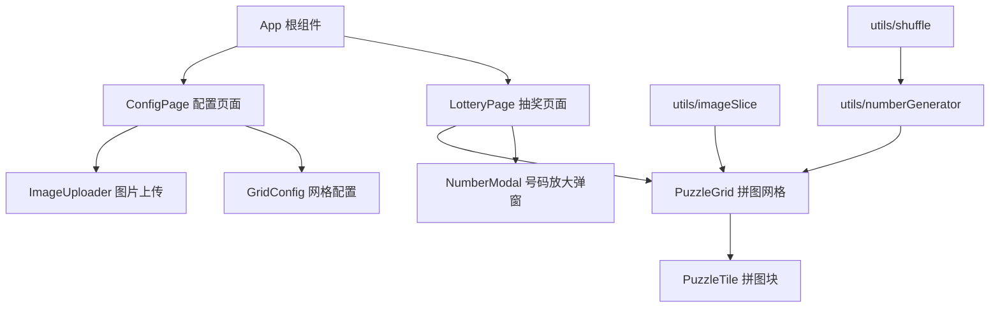

# 设计文档

## 概述

抽奖拼图系统是一个基于浏览器的单页应用（SPA），用于活动现场抽奖。系统由两个主要页面组成：配置页面和抽奖页面。活动组织者在配置页面上传图片并设置网格参数，进入抽奖页面后，图片被切分为拼图网格。参与者直接点击拼图块翻转揭示中奖号码，整个过程无需开始/结束按钮，交互简洁直观。

### 技术选型

- **前端框架**：React 18 + TypeScript
- **构建工具**：Vite
- **样式方案**：CSS Modules
- **状态管理**：React useState/useReducer（应用状态简单，无需引入外部状态库）
- **动画**：CSS 3D Transform（翻转动画）
- **测试**：Vitest + fast-check（属性测试）

### 设计决策

1. **纯前端应用**：无需后端服务，所有逻辑在浏览器端完成，图片处理使用 Canvas API。
2. **CSS 3D Transform 翻转**：使用 `transform: rotateY(180deg)` 实现拼图块翻转效果，性能优于 JavaScript 动画。
3. **Canvas 切图**：使用 HTML5 Canvas 将上传图片按网格切分为多个小图片 Data URL，避免服务端依赖。
4. **Fisher-Yates 洗牌**：号码随机分配使用 Fisher-Yates 算法，保证均匀随机性。

## 架构



系统采用组件化架构，核心流程：

1. `ConfigPage` 收集用户配置（图片 + 行列数）
2. 配置完成后路由切换到 `LotteryPage`
3. `LotteryPage` 初始化时调用工具函数切图、生成号码、洗牌分配
4. 用户点击 `PuzzleTile` 触发翻转动画，完成后弹出 `NumberModal` 放大显示号码

## 组件与接口

### ConfigPage 配置页面组件

```typescript
interface ConfigPageProps {
  onConfigComplete: (config: LotteryConfig) => void;
}

// 职责：收集图片文件和网格参数，校验后传递给父组件
```

### ImageUploader 图片上传组件

```typescript
interface ImageUploaderProps {
  onImageSelect: (file: File) => void;
  selectedFile: File | null;
}

// 职责：处理图片文件选择，支持 JPG/PNG 格式校验
```

### GridConfig 网格配置组件

```typescript
interface GridConfigProps {
  rows: number;
  cols: number;
  onRowsChange: (rows: number) => void;
  onColsChange: (cols: number) => void;
}

// 职责：提供行列数输入，默认值行=5，列=20
```

### LotteryPage 抽奖页面组件

```typescript
interface LotteryPageProps {
  config: LotteryConfig;
}

// 职责：管理抽奖状态，协调拼图网格和号码弹窗
```

### PuzzleGrid 拼图网格组件

```typescript
interface PuzzleGridProps {
  tiles: TileData[];
  onTileClick: (index: number) => void;
  isAnimating: boolean;
}

// 职责：以 16:9 比例全屏渲染拼图网格
```

### PuzzleTile 拼图块组件

```typescript
interface PuzzleTileProps {
  tile: TileData;
  onClick: () => void;
  disabled: boolean;
}

// 职责：渲染单个拼图块，处理翻转动画
```

### NumberModal 号码放大弹窗组件

```typescript
interface NumberModalProps {
  number: string;
  visible: boolean;
  onClose: () => void;
}

// 职责：放大显示中奖号码，点击关闭恢复网格视图
```

### 工具函数接口

```typescript
// utils/imageSlice.ts
function sliceImage(image: HTMLImageElement, rows: number, cols: number): string[];
// 将图片按行列切分，返回每块的 Data URL 数组

// utils/numberGenerator.ts
function generateNumbers(rows: number, cols: number): string[];
// 根据行列数生成号码列表，如 ["A1", "A2", ..., "E20"]

function getRowLabel(rowIndex: number): string;
// 将行索引转为字母标识，支持超过26行的双字母（AA, AB...）

// utils/shuffle.ts
function shuffle<T>(array: T[]): T[];
// Fisher-Yates 洗牌算法，返回新的随机排列数组
```

## 数据模型

```typescript
/** 抽奖配置 */
interface LotteryConfig {
  imageFile: File;
  rows: number;  // 垂直行数，默认 5
  cols: number;  // 水平列数，默认 20
}

/** 拼图块数据 */
interface TileData {
  index: number;          // 拼图块在网格中的位置索引
  imageDataUrl: string;   // 该块对应的图片片段 Data URL
  lotteryNumber: string;  // 分配的抽奖号码（如 "C15"）
  isFlipped: boolean;     // 是否已翻转
}

/** 抽奖页面状态 */
interface LotteryState {
  tiles: TileData[];
  isAnimating: boolean;       // 是否正在播放翻转动画
  activeNumber: string | null; // 当前放大显示的号码，null 表示无弹窗
  allFlipped: boolean;         // 是否所有拼图块已翻转
}
```


## 正确性属性

*属性是指在系统所有有效执行中都应成立的特征或行为——本质上是对系统应做什么的形式化陈述。属性是人类可读规格说明与机器可验证正确性保证之间的桥梁。*

### 属性 1：文件格式校验

*对于任意*文件，只有扩展名为 JPG 或 PNG 的文件才应被接受上传，其他格式应被拒绝。

**验证：需求 1.2**

### 属性 2：网格输入校验

*对于任意*输入值，若该值小于 1、为 0、为负数、为小数或非数字，则系统应拒绝该输入并提示错误。

**验证：需求 1.6**

### 属性 3：图片切分数量

*对于任意*有效的行数 rows 和列数 cols，sliceImage 函数应返回恰好 rows × cols 个图片片段。

**验证：需求 2.1**

### 属性 4：初始状态全部未翻转

*对于任意*有效的网格配置，初始化后所有 TileData 的 isFlipped 属性应为 false。

**验证：需求 2.3**

### 属性 5：号码生成正确性

*对于任意*有效的行数 rows 和列数 cols，generateNumbers 应生成恰好 rows × cols 个唯一号码，每个号码格式为"行字母+列数字"，列数字从 1 到 cols。

**验证：需求 2.4, 5.2, 5.3**

### 属性 6：洗牌是排列

*对于任意*数组，shuffle 函数返回的结果应包含与原数组完全相同的元素（相同元素、相同数量），且长度不变。

**验证：需求 2.5**

### 属性 7：行标识生成

*对于任意*非负整数行索引，getRowLabel 应生成正确的字母标识：索引 0-25 对应 A-Z，索引 26 及以上使用双字母（AA, AB, AC...）。

**验证：需求 5.1, 5.4**

### 属性 8：点击翻转状态变更

*对于任意*未翻转的拼图块，点击后其 isFlipped 状态应变为 true，且其他拼图块的状态不受影响。

**验证：需求 3.1**

### 属性 9：弹窗显示正确号码

*对于任意*被翻转的拼图块，弹窗中显示的号码应与该拼图块被分配的 lotteryNumber 完全一致。

**验证：需求 3.2**

### 属性 10：翻转状态持久化

*对于任意*翻转操作序列，关闭弹窗后所有之前已翻转的拼图块应保持 isFlipped 为 true。

**验证：需求 3.4**

### 属性 11：动画期间阻止并发点击

*对于任意*处于动画播放状态（isAnimating 为 true）的系统，对任何拼图块的点击操作应被忽略，不改变任何状态。

**验证：需求 3.5**

### 属性 12：已翻转拼图块点击无效

*对于任意*已翻转的拼图块（isFlipped 为 true），点击操作不应改变系统中任何拼图块的状态。

**验证：需求 4.2**

## 错误处理

| 场景 | 处理方式 |
|------|---------|
| 未上传图片点击"进入抽奖" | 显示提示"请先上传抽奖图片"，阻止跳转 |
| 切分数量输入非法值 | 显示提示"切分数量必须为大于 0 的正整数"，阻止跳转 |
| 图片格式不支持 | 文件选择器限制 accept 属性，额外校验扩展名 |
| 图片加载失败 | 显示错误提示，允许重新上传 |
| 所有拼图块已翻转 | 显示提示"所有号码已抽完" |
| 动画播放中点击其他拼图块 | 静默忽略，不产生任何响应 |
| 点击已翻转拼图块 | 静默忽略，不产生任何响应 |

## 测试策略

### 双重测试方法

本项目采用单元测试与属性测试相结合的策略：

- **单元测试**：验证具体示例、边界情况和错误条件
- **属性测试**：验证跨所有输入的通用属性

### 属性测试配置

- **测试库**：fast-check（JavaScript/TypeScript 属性测试库）
- **测试框架**：Vitest
- **每个属性测试最少运行 100 次迭代**
- **每个测试必须用注释标注对应的设计属性**
- **标注格式**：`Feature: lottery-puzzle-system, Property {number}: {property_text}`
- **每个正确性属性由一个属性测试实现**

### 单元测试覆盖

单元测试聚焦于：
- 配置页面默认值验证（行=5，列=20）
- 未上传图片的错误提示
- 非法输入的错误提示
- 页面跳转逻辑
- 所有拼图块翻转完毕的提示
- 组件渲染的基本快照测试

### 属性测试覆盖

属性测试聚焦于：
- 文件格式校验（属性 1）
- 网格输入校验（属性 2）
- 图片切分数量（属性 3）
- 初始状态（属性 4）
- 号码生成正确性（属性 5）
- 洗牌排列性（属性 6）
- 行标识生成（属性 7）
- 翻转状态变更（属性 8）
- 弹窗号码正确性（属性 9）
- 翻转状态持久化（属性 10）
- 动画阻止并发（属性 11）
- 已翻转点击无效（属性 12）
