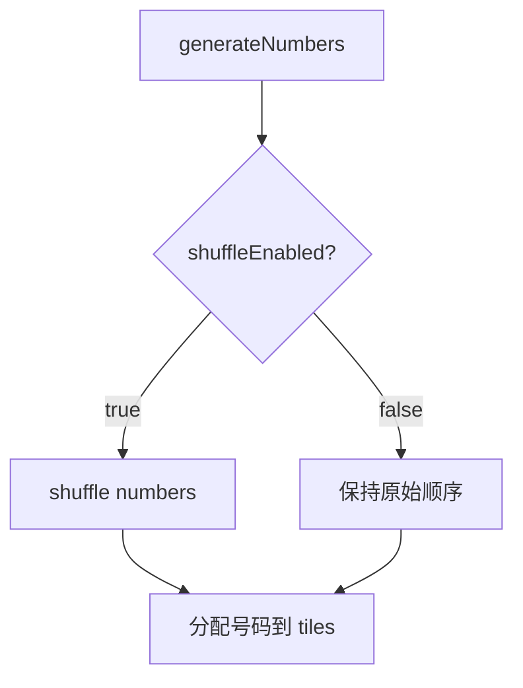
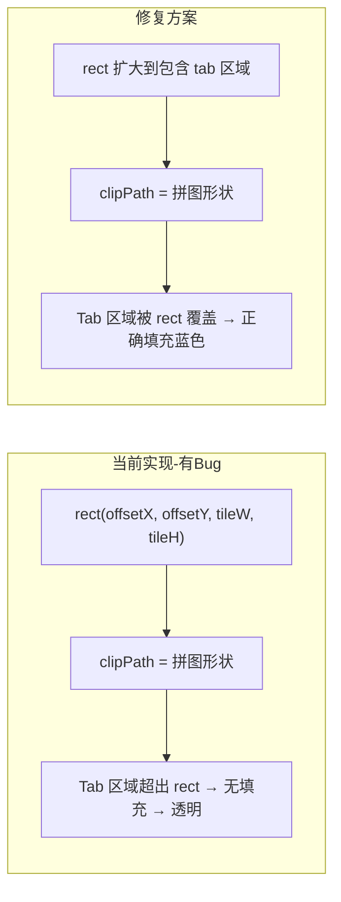
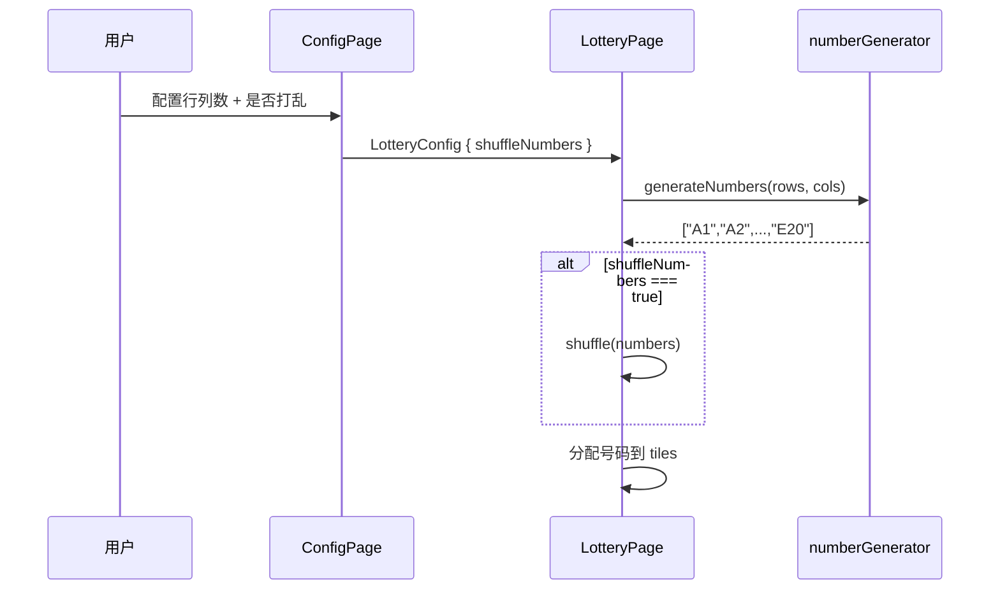
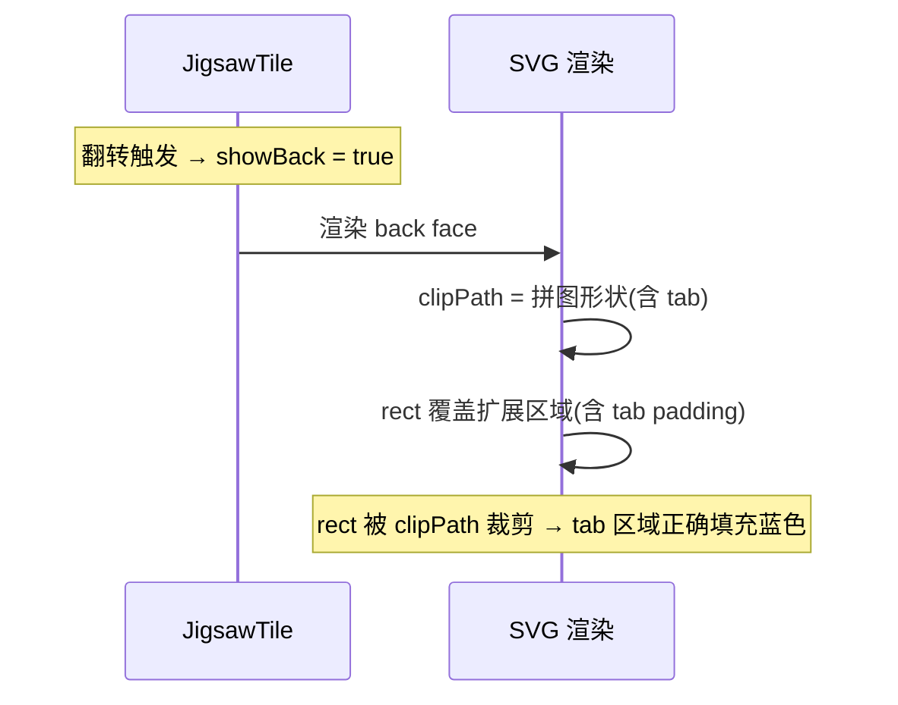

# 设计文档：拼图显示修复 (puzzle-display-fixes)

## 概述

本功能包含两项改进：

1. **号码排列顺序改进**：当前抽奖号码通过 `shuffle()` 打乱后分配给拼图块，导致号码位置随机。需要改为默认按顺序排列（左到右 1~cols，上到下 A~E），打乱顺序作为可选项（默认不打乱）。

2. **拼图凸出部分颜色修复**：翻转后的拼图卡片，凸出方块（tab）区域超出了基础矩形范围，但背面的 `<rect>` 填充仅覆盖基础矩形区域。由于 `clipPath` 裁剪到完整拼图形状（含 tab），tab 区域没有被蓝色背景填充覆盖，导致该区域透明，露出底层图片。此 bug 同时存在于 `JigsawTile.tsx` 的卡片背面和 `NumberModal.tsx` 的弹窗中。

## 架构

### 问题1：号码排列流程



### 问题2：拼图 Tab 颜色 Bug 根因



## 组件与接口

### 组件1：ConfigPage（号码排列配置）

**目的**：在配置页面增加"打乱号码顺序"开关

**接口变更**：
```typescript
// types/index.ts - LotteryConfig 新增字段
export interface LotteryConfig {
  imageFile: File;
  rows: number;
  cols: number;
  backgroundImage?: File;
  shuffleNumbers?: boolean;  // 新增：是否打乱号码，默认 false
}
```

**职责**：
- 提供 checkbox/toggle 让用户选择是否打乱号码
- 将 `shuffleNumbers` 配置传递给 `LotteryPage`

### 组件2：LotteryPage（号码分配逻辑）

**目的**：根据配置决定是否打乱号码

**当前代码（有问题）**：
```typescript
// LotteryPage.tsx initTiles 中
const numbers = generateNumbers(rows, cols);
const shuffledNumbers = shuffle(numbers);  // 始终打乱
// ...
lotteryNumber: shuffledNumbers[i],
```

**修复后**：
```typescript
const numbers = generateNumbers(rows, cols);
const finalNumbers = config.shuffleNumbers ? shuffle(numbers) : numbers;
// ...
lotteryNumber: finalNumbers[i],
```

### 组件3：JigsawTile 背面渲染（Tab 颜色修复）

**目的**：修复翻转后 tab 区域未被背景色覆盖的问题

**根因分析**：
- 拼图形状的 tab 凸出部分超出基础矩形 `(offsetX, offsetY, tileWidth, tileHeight)`
- 背面 `<rect>` 仅覆盖基础矩形，被 `clipPath`（拼图形状）裁剪后，tab 区域无填充
- tab 凸出量约为 `tileW * 0.25` 或 `tileH * 0.25`（见 `jigsawPath.ts`）

**当前代码（有 Bug）**：
```typescript
// JigsawTile.tsx - back face
<rect x={offsetX} y={offsetY} width={tileWidth} height={tileHeight}
  fill="rgb(5, 69, 214)" clipPath={`url(#${clipId}-back)`} />
```

**修复方案**：将 `<rect>` 扩大到包含所有可能的 tab 凸出区域：
```typescript
// JigsawTile.tsx - back face
<rect x={offsetX - padX} y={offsetY - padY}
  width={tileWidth + padX * 2} height={tileHeight + padY * 2}
  fill="rgb(5, 69, 214)" clipPath={`url(#${clipId}-back)`} />
```

### 组件4：NumberModal 弹窗渲染（Tab 颜色修复）

**目的**：修复弹窗中 tab 区域同样的颜色问题

**当前代码（有 Bug）**：
```typescript
// NumberModal.tsx - TileBackSvg
<rect x={offsetX} y={offsetY} width={tileWidth} height={tileHeight}
  fill="rgb(5, 69, 214)" clipPath="url(#modal-tile-clip)" />
```

**修复方案**：同样扩大 rect 范围：
```typescript
<rect x={offsetX - padX} y={offsetY - padY}
  width={tileWidth + padX * 2} height={tileHeight + padY * 2}
  fill="rgb(5, 69, 214)" clipPath="url(#modal-tile-clip)" />
```

## 数据模型

### LotteryConfig 变更

```typescript
export interface LotteryConfig {
  imageFile: File;
  rows: number;
  cols: number;
  backgroundImage?: File;
  shuffleNumbers?: boolean;  // 新增，默认 false
}
```

**验证规则**：
- `shuffleNumbers` 为可选布尔值，缺省时视为 `false`

## 主要流程

### 号码分配流程



### 拼图翻转渲染流程



## 关键函数与形式化规格

### 函数1：号码分配逻辑（LotteryPage.initTiles）

```typescript
// 修改后的号码分配
const numbers = generateNumbers(rows, cols);
const finalNumbers = config.shuffleNumbers ? shuffle(numbers) : numbers;
```

**前置条件**：
- `rows > 0` 且 `cols > 0`
- `config.shuffleNumbers` 为 `boolean | undefined`

**后置条件**：
- 当 `shuffleNumbers === false` 或 `undefined` 时：`finalNumbers[i] === numbers[i]` 对所有 `i`
- 当 `shuffleNumbers === true` 时：`finalNumbers` 是 `numbers` 的一个排列
- `finalNumbers.length === rows * cols`
- 默认排列下，tile 在位置 `(r, c)` 的号码为 `getRowLabel(r) + (c+1)`

### 函数2：JigsawTile 背面 rect 渲染

```typescript
// 修复后的 back face rect
<rect
  x={offsetX - padX}
  y={offsetY - padY}
  width={tileWidth + padX * 2}
  height={tileHeight + padY * 2}
  fill="rgb(5, 69, 214)"
  clipPath={`url(#${clipId}-back)`}
/>
```

**前置条件**：
- `padX = tileWidth * PAD`，`padY = tileHeight * PAD`
- `PAD >= 0.25`（tab 凸出量为 `0.25`，padding 需 >= 凸出量）
- 当前 `PAD = 0.30`，满足条件

**后置条件**：
- rect 完全覆盖拼图形状的 bounding box（含所有 tab 凸出）
- clipPath 裁剪后，所有拼图形状内的区域都被蓝色填充
- tab 区域不再透明

**循环不变量**：不适用

### 函数3：NumberModal TileBackSvg rect 渲染

```typescript
// 修复后的 modal rect
<rect
  x={offsetX - padX}
  y={offsetY - padY}
  width={tileWidth + padX * 2}
  height={tileHeight + padY * 2}
  fill="rgb(5, 69, 214)"
  clipPath="url(#modal-tile-clip)"
/>
```

**前置条件**：同函数2

**后置条件**：同函数2，弹窗中 tab 区域正确显示蓝色背景

## 示例用法

### 号码排列 - 默认顺序（不打乱）

```typescript
// 5行20列，默认不打乱
const config: LotteryConfig = {
  imageFile: file,
  rows: 5,
  cols: 20,
  shuffleNumbers: false, // 或不传
};

// 结果：
// 位置(0,0) → "A1", 位置(0,1) → "A2", ..., 位置(0,19) → "A20"
// 位置(1,0) → "B1", 位置(1,1) → "B2", ..., 位置(1,19) → "B20"
// ...
// 位置(4,0) → "E1", 位置(4,1) → "E2", ..., 位置(4,19) → "E20"
```

### 号码排列 - 打乱顺序

```typescript
const config: LotteryConfig = {
  imageFile: file,
  rows: 5,
  cols: 20,
  shuffleNumbers: true,
};

// 结果：号码随机分配，如位置(0,0)可能是"D15"
```

### Tab 颜色修复效果

```typescript
// 修复前：tab 区域透明，露出底层图片
// <rect x={50} y={30} width={100} height={80} ... clipPath=拼图形状 />
//   → tab 凸出到 y=10 的区域无填充

// 修复后：tab 区域被蓝色覆盖
// <rect x={20} y={6} width={160} height={128} ... clipPath=拼图形状 />
//   → rect 覆盖了 tab 凸出区域，clipPath 裁剪后 tab 正确填充
```

## 正确性属性

*属性是指在系统所有有效执行中都应成立的特征或行为——本质上是对系统应做什么的形式化陈述。属性是人类可读规格与机器可验证正确性保证之间的桥梁。*

### 属性 1：号码顺序一致性

*对任意* 行数 rows 和列数 cols，当 shuffleNumbers 为 false 或 undefined 时，位置 (r, c) 的拼图块号码必须等于 `getRowLabel(r) + (c + 1)`。

**验证: 需求 1.1, 2.1**

### 属性 2：号码集合完整性

*对任意* 行数 rows、列数 cols 和任意 shuffleNumbers 设置（true/false/undefined），分配给所有拼图块的号码集合必须与 `generateNumbers(rows, cols)` 的输出集合完全相同（无遗漏、无重复、无多余）。

**验证: 需求 1.2, 1.4**

### 属性 3：背面填充矩形覆盖拼图包围盒

*对任意* tileWidth 和 tileHeight（正数），以 PAD = 0.30 扩展后的背面填充矩形（x = offsetX - tileWidth × PAD, y = offsetY - tileHeight × PAD, width = tileWidth × (1 + 2 × PAD), height = tileHeight × (1 + 2 × PAD)）必须完全包含拼图形状的包围盒（含最大 Tab 凸出量 0.25 × tileWidth 或 0.25 × tileHeight）。此属性同时适用于 Jigsaw_Tile 背面和 Number_Modal 弹窗。

**验证: 需求 3.1, 3.3, 4.1, 4.3**

## 错误处理

### 场景1：shuffleNumbers 未传递

**条件**：旧版配置不包含 `shuffleNumbers` 字段
**响应**：视为 `false`，保持顺序排列（向后兼容）
**恢复**：无需特殊处理

### 场景2：极端网格尺寸下的 tab 渲染

**条件**：非常小的 tileWidth/tileHeight
**响应**：PAD 比例（0.30）始终相对于 tile 尺寸，自动适配
**恢复**：无需特殊处理

## 测试策略

### 单元测试

- 验证 `shuffleNumbers: false` 时号码按顺序分配
- 验证 `shuffleNumbers: true` 时号码是原始集合的排列
- 验证 `shuffleNumbers` 未传递时默认不打乱

### 属性测试

**属性测试库**：fast-check

- 对任意 `rows` 和 `cols`，号码集合的完整性不受 shuffle 选项影响
- 对任意 tile 位置，扩展后的 rect 范围必须包含 tab 凸出的最大范围

### 视觉/集成测试

- 翻转拼图块后，tab 区域应显示蓝色背景而非底层图片
- 弹窗中的拼图形状 tab 区域同样显示蓝色背景
- 默认配置下，号码从左到右、从上到下按顺序排列

## 依赖

- 无新增外部依赖
- 修改涉及的现有模块：
  - `src/types/index.ts`（LotteryConfig 类型）
  - `src/components/ConfigPage.tsx`（新增 shuffle 开关）
  - `src/components/LotteryPage.tsx`（条件 shuffle 逻辑）
  - `src/components/JigsawTile.tsx`（扩大 back face rect）
  - `src/components/NumberModal.tsx`（扩大 modal rect）
